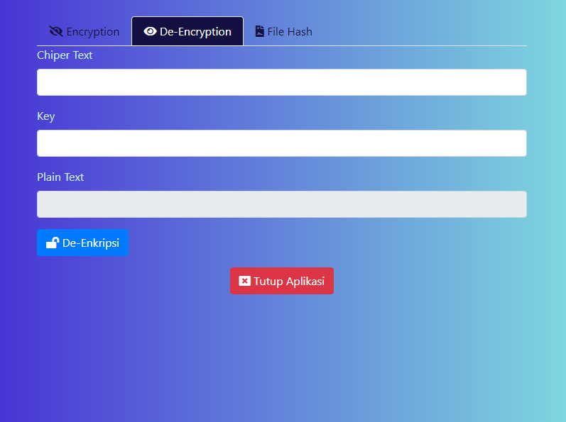

# Ende

Aplikasi enkripsi dan de-enkripsi data dengan algoritma AES dan pembaca hash file yang saat ini support MD5 dan SHA-2

# Screenshots

### Encryption

### De-Encryption

### File Hash

# Library

* [Bootstrap](https://getbootstrap.com)
* [Jquery](https://jquery.com)
* [Electron](https://electronjs.org)
* [CryptoJS](https://https://cryptojs.gitbook.io/docs/)
* [Fontawesome](https://fontawesome.com)

# Source Credit

* Icon dibuat oleh [Kmg Design](https://www.iconfinder.com/kmgdesignid)